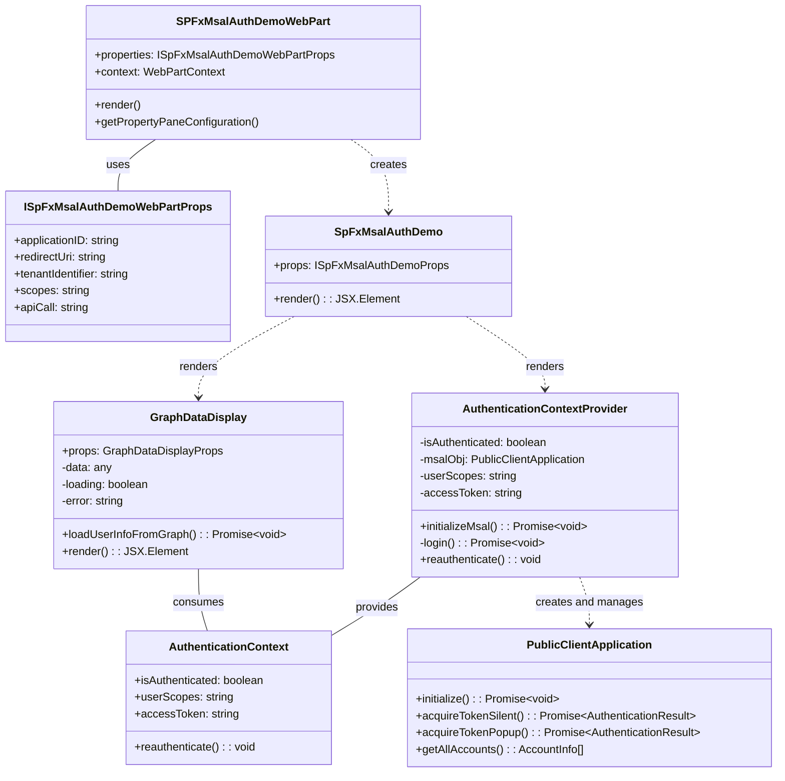

# Authenticate in SharePoint Framework Solution (SPFx) with MSAL2 – Part 1

## SPFx solutions and the (missing) «principle of least privilege»

SharePoint Framework (SPFx) solutions often need to access protected resources such as Microsoft Graph API or custom APIs. Although SPFx provides built-in authentication capabilities, certain scenarios require more granular control over the authentication process and permissions. In certain situations, it will become necessary to implement your own authentication within your SPFx webpart or extension: **by making use of the Microsoft Authentication Library (MSAL) you can gain finer control over the authentication process while following the «principle of least privilege» (PoLP).**

> [!NOTE]
> If you are more interested in the principle of least privilege and what permissions could look like in M365 solutions, you can read this article: [Scopes and permissions in the Microsoft identity platform](https://learn.microsoft.com/en-us/entra/identity-platform/scopes-oidc?wt.mc_id=MVP_383763)

To make it clear from the beginning: unfortunately, the commonly used authentication process provided by SPFx doesn't really follow a proper PoLP approach. But let's start at the beginning.

## The out-of-the-box Approaches or: the Standard («Built-in») Authentication from any SPFx Solution

By default, SPFx solutions can access Microsoft Graph API and other secured APIs via built-in authentication mechanisms provided by the framework. The implementation of these mechanisms is fairly easy and therefore very convenient.

SharePoint Framework provides two primary ways to authenticate to Entra ID-secured resources:

1. using the `AadHttpClient` class to call any API secured by Entra ID
1. using the `MSGraphClient` class to call the Graph API directly

### Using AadHttpClient

The `AadHttpClient` class in SPFx allows web parts and extensions to call Entra ID-secured APIs without having to handle authentication details directly. Behind the scenes, it uses the OAuth implicit flow, which brings up some [security concerns for modern (web) applications](https://learn.microsoft.com/en-us/entra/identity-platform/v2-oauth2-implicit-grant-flow?wt.mc_id=MVP_383763). 

> [!NOTE]
> Read more about the *authorization code flow with PKCE («No Proof Key for Code Exchange»)* and why it is a better alternative to the implicit flow: [Microsoft identity platform and OAuth 2.0 authorization code flow](https://learn.microsoft.com/en-us/entra/identity-platform/v2-oauth2-auth-code-flow?wt.mc_id=MVP_383763)

As described in the [official documentation](https://learn.microsoft.com/en-us/sharepoint/dev/spfx/use-aadhttpclient?wt.mc_id=MVP_383763), this approach works as follows to contact your API (or any official API provided and documented by Microsoft):

```typescript
import { AadHttpClient, HttpClientResponse } from '@microsoft/sp-http';

// Example of using AadHttpClient
this.context.aadHttpClientFactory
  .getClient('api://example.com/app-id') // set your resource or any API provided by Microsoft
  .then((client: AadHttpClient): void => {
    client
      .get('https://api.example.com/resource', AadHttpClient.configurations.v1)
      .then(response => {
        // Handle response
      });
  });
```

The key aspects of this built-in authentication flow are:

- **API Permission Registration**: The API you want to access must be registered in the SharePoint Admin Center under "API Access"
- **Permission Request Process**: 
  1. SPFx package includes a manifest with requested permissions
  2. Package is deployed to the app catalog
- **Permission Scope**: Permissions are granted at the tenant level and apply to all instances of your SPFx solution
- **Token Acquisition**: The framework handles token acquisition, renewal, and caching behind the scenes

### Using the `MSGraphClient` class

Similarly, for calling resources from the Microsoft Graph API specifically, SPFx provides the `MSGraphClient` out-of-the-box:

```typescript
this.context.msGraphClientFactory
  .getClient()
  .then((client: MSGraphClient): void => {
    client
      .api('/me') // call any graph route according your needs
      .get((error, response) => {
        // Handle response
      });
  });
```

### Limitations of these approaches

While (to be honest: very 😃) convenient, these out-of-the-box approaches have significant limitations:

- **Tenant-Wide Permissions**: Permissions must be approved by tenant administrators in the SharePoint Admin Center and are granted at the tenant level for **ALL** SPFx applications 😳
- **No Granular Control**: It's impossible to restrict permissions for specific web part instances or extensions – granted permissions can be leveraged by **ANY** client-side request in the whole tenant!
- **Removing a solution doesn't revoke their (former) permissions**: admins have to manually revoke permissions after deleting (if they do so!)
- **Limited Customization**: You can't easily use custom authentication flows, policies, or handle specific authentication scenarios
- **Permission Bundling**: All permissions are bundled together (in Entra's **SharePoint Online Client Extensibility Web Application Principal** app registration), making it difficult to follow the principle of least privilege
- **Admin Overhead**: Requires SharePoint administrators to approve permissions, which can be a bottleneck in large organizations

As «Mr. M365 Development» Andrew Connell noted in discussions about Graph API authentication in SPFx, the built-in approach often leads to excessive permissions being granted, violating the principle of least privilege.

## The «proper» approach: Custom Authentication from your SPFx Solution

While the standard («built-in») authentication process is very easy to follow, the custom authentication flow takes far better account of the *principle of least privilege*. 

By implementing MSAL directly (as shown below), you gain really crucial security advantages while maintaining control over your application's authentication process. And that's how it works.

### Define Your Own App Registration in Microsoft Entra ID

To gain more control, we need to register our own application in Microsoft Entra ID.
The key benefit of this approach is that you only request the specific permissions your application needs – rather than making use of «commonly used» permissions how the built-in SPFx authentication flow does.

By making use of the [CLI for Microsoft 365 command to create the Entra application](https://pnp.github.io/cli-microsoft365/cmd/entra/app/app-add/), you can register a new application with less effort:

```plaintext
m365 entra app add --name "MSAL AuthN SPFx App" --platform spa --redirectUris "https://{tenant}.sharepoint.com" --apisDelegated "https://graph.microsoft.com/User.Read" --grantAdminConsent

```

> [!NOTE]
> Add any additional permissions that your application *specifically* requires by specifying the corresponding permissions in the `--apisDelegated` parameter.

Alternatively, if you want to take a manual approach (which I wouldn't 😃), make sure you register your application as follows:

- **Create an app registration** in the Microsoft Entra admin center (<https://entra.microsoft.com/#view/Microsoft_AAD_RegisteredApps>)
- **Configure it as a Single-page Application (SPA)**:
  - Authentication type: Single-page application (SPA)
  - Supported account types: Accounts in this organizational directory only (single tenant)
- **Set appropriate redirect URIs**: 
  - Add your SharePoint domain: `https://{tenant}.sharepoint.com` 
- **Request only the necessary API permissions**:
  - For basic functionality, Microsoft Graph `User.Read` is sufficient
  - Add any additional permissions your application *specifically* requires

Once registered, you'll need these three values from the registered app:

- **Application (client) ID** to identify your app registration
- **Directory (tenant) ID** to identify your Microsoft 365 tenant
- **Configured redirect URI** thandle the authentication response

These values 👆 are used in your SPFx solution with MSAL so that your web part can authenticate itself *using your specific application registration* – and not using the standard SPFx authorisations!

## Implementing MSAL2 Authentication in SPFx

Read more about the concrete implementation details: ((LINK: Authenticate in SharePoint Framework Solution (SPFx) with MSAL – Part 2))


# Authenticate in SharePoint Framework Solution (SPFx) with MSAL2 – Part 2

((LINK: Part I)) of this series covers the limitations of SharePoint Framework's built-in authentication methods and presents a more secure alternative that uses the Microsoft Authentication Library (MSAL) directly in SPFx solutions. 

## Implementing MSAL2 Authentication in SPFx

Let's now finally focus on the main application that contains the coding and the MSAL implementation. I've decided to build the whole implementation in TypeScript (within a React app for SPFx) by using `@azure/msal-browser` 

> [!NOTE]
> Please note that I've chosen the implementation with `@azure/msal-browser` instead of the modularised version of `@azure/msal-react` for educational purposes 😃.

Let's assume we will build this dependency of modules or classes (as you wish to say 😃) with these dependencies between:


> [!NOTE]
> This Mermaid diagram was created by using *Claude Sonnet 3.7* from my real implementation – fantastic, isn't it?


The core of our implementation is the `AuthenticationContext`. This component manages the authentication state as well as a function for reauthentication and makes these guys available throughout the application:

```typescript
import { Configuration, PublicClientApplication } from "@azure/msal-browser";
import * as React from "react";

export const AuthenticationContext = React.createContext<AuthenticationContextProps>({
  isAuthenticated: false,
  reauthenticate: () => { },
});
```

As already mentioned, `AuthenticationContext` provides functionality for the authentication status for  components that rely on authentication information whereas the `AuthenticationContextProvider` component initializes MSAL and handles even the token acquisition:

```typescript
export const AuthenticationContextProvider = (props: AuthenticationContextProviderProps): JSX.Element => {
  // State definitions
  const [isAuthenticated, setIsAuthenticated] = React.useState<boolean>(false);
  const [msalObj, setMsalInstance] = React.useState<PublicClientApplication | undefined>(undefined);
  const [userScopes, setUserScopes] = React.useState<string>('');
  const [accessToken, setAccessToken] = React.useState<string>('');

  // MSAL configuration
  const config: Configuration = {
    auth: {
      clientId: props.clientId,
      authority: `https://login.microsoftonline.com/${props.tenantId}`,
      redirectUri: props.redirectUri ?? window.location.origin,
    },
    cache: {
      cacheLocation: "localStorage",
      storeAuthStateInCookie: false,
    },
  };
  
  // ... implementation of authentication methods ...
}
```

To make this work, make sure you pass these properties (and just omit the optionals – at least `scopes`!) to the `AuthenticationContextProvider`:

```typescript
interface AuthenticationContextProviderProps extends React.PropsWithChildren<{}> {
  clientId: string; // The client id of your app registration in Microsoft Entra ID
  tenantId: string; // Your tenant id (that holds the app registration)
  scopes?: string; // Optional – never set this; The scopes that can be consented to the calling user (will overwrite the permissions that are set and consented by an admin in case the calling user has admin rights!)
  redirectUri?: string; // Optional; the redirect uri
}
```

### Handle the (Silent) Token Acquisition

The implementation attempts to acquire a token silently (by calling the `login()` function the first time), which ensures a smooth user experience:

```typescript
async function login(): Promise<void> {
  try {
    if (msalObj) {
      const result = await msalObj.acquireTokenSilent({
        account: msalObj.getAllAccounts()[0],
        scopes: props.scopes ? [...props.scopes.split(',')] : [],
      });

      console.log('Silent token result:', result);

      if (msalObj && result.accessToken) {
        const accounts = msalObj.getAllAccounts();
        setIsAuthenticated(accounts.length > 0);
        setUserScopes(result.scopes.join(', '));
        setAccessToken(result.accessToken);
      }
    }
  } catch (error) {
    console.error("Error acquiring token silently:", error);
  }
}
```

### Integrating with SPFx WebPart

The webpart initializes with configurable parameters that connect to our Entra ID application:

```tsx
export interface ISpFxMsalAuthDemoWebPartProps {
  applicationID: string;
  redirectUri: string;
  tenantIdentifier: string;
  scopes: string;
  apiCall: string;
}
```

These properties are passed to our React component:

```tsx
public render(): void {
  const element: React.ReactElement<ISpFxMsalAuthDemoProps> = React.createElement(
    SpFxMsalAuthDemo,
    {
      applicationID: this.properties.applicationID,
      redirectUri: this.properties.redirectUri,
      tenantIdentifier: this.properties.tenantIdentifier,
      scopes: this.properties.scopes,
      apiCall: this.properties.apiCall,
      httpClient: this.context.httpClient,
      userMail: this.context.pageContext.user.email,
    }
  );
  ReactDom.render(element, this.domElement);
}
```

### Making Authenticated API Calls

With our AuthenticationContext in place, components can now consume the authentication state and access token to make authenticated API calls:

```tsx
export const GraphDataDisplay: React.FC<GraphDataDisplayProps> = (props) => {
  const { isAuthenticated, userScopes, accessToken, reauthenticate } = React.useContext(AuthenticationContext);
  const { applicationID, tenantIdentifier, redirectUri, httpClient, apiCall } = props;

  async function loadUserInfoFromGraph(): Promise<void> {
    console.log(`calling graph with access token: ${accessToken?.substring(0, 100)}...`);

    const response = await httpClient.get(apiCall, HttpClient.configurations.v1, {
      headers: {
        'Authorization': `Bearer ${accessToken}`
      }
    });

    // ... process response ...
  }

  // ... component rendering ...
}
```

## 4. Deep Dive: Understanding the MSAL Authentication Flow

Let's examine the key parts of the authentication flow:

1. **Initialization**: The `PublicClientApplication` from MSAL is initialized with our app's configuration:
   ```typescript
   const msalObj = new PublicClientApplication(config);
   await msalObj.initialize();
   ```

2. **Silent Token Acquisition**: We first try to get tokens silently, which works if the user has previously authenticated:
   ```typescript
   const result = await msalObj.acquireTokenSilent({
     account: msalObj.getAllAccounts()[0],
     scopes: props.scopes ? [...props.scopes.split(',')] : [],
   });
   ```

3. **Token Storage**: MSAL handles token caching in the browser's localStorage:
   ```typescript
   cache: {
     cacheLocation: "localStorage",
     storeAuthStateInCookie: false,
   },
   ```

4. **Token Usage**: The acquired token is used in API calls:
   ```typescript
   const response = await httpClient.get(apiCall, HttpClient.configurations.v1, {
     headers: {
       'Authorization': `Bearer ${accessToken}`
     }
   });
   ```

## 5. Summary and Conclusion

Implementing custom authentication in SPFx using MSAL provides several advantages:

1. **Granular Control**: Define exactly which permissions your application needs
2. **Least Privilege**: Comply with security best practices by requesting only necessary permissions
3. **Flexibility**: Easily adapt the authentication flow to specific requirements
4. **Separation of Concerns**: Decouple authentication from the SharePoint context

While this approach requires more initial setup than using the built-in SPFx authentication mechanisms, it provides greater control and security for enterprise applications. This pattern is particularly valuable when you're building solutions that need to access sensitive data or when you want to ensure your application follows the principle of least privilege.

By managing authentication through a custom Entra ID app registration and MSAL, you gain the ability to precisely control which resources your SPFx solution can access, making your applications more secure and compliant with modern security practices.

## References and Further Reading

- [Microsoft Authentication Library (MSAL) Documentation](https://docs.microsoft.com/en-us/azure/active-directory/develop/msal-overview)
- [SPFx with MSAL in GitHub](https://github.com/your-repo-link)
- [SharePoint Framework Documentation](https://docs.microsoft.com/en-us/sharepoint/dev/spfx/sharepoint-framework-overview)
- [Azure AD App Registration Documentation](https://docs.microsoft.com/en-us/azure/active-directory/develop/quickstart-register-app)
